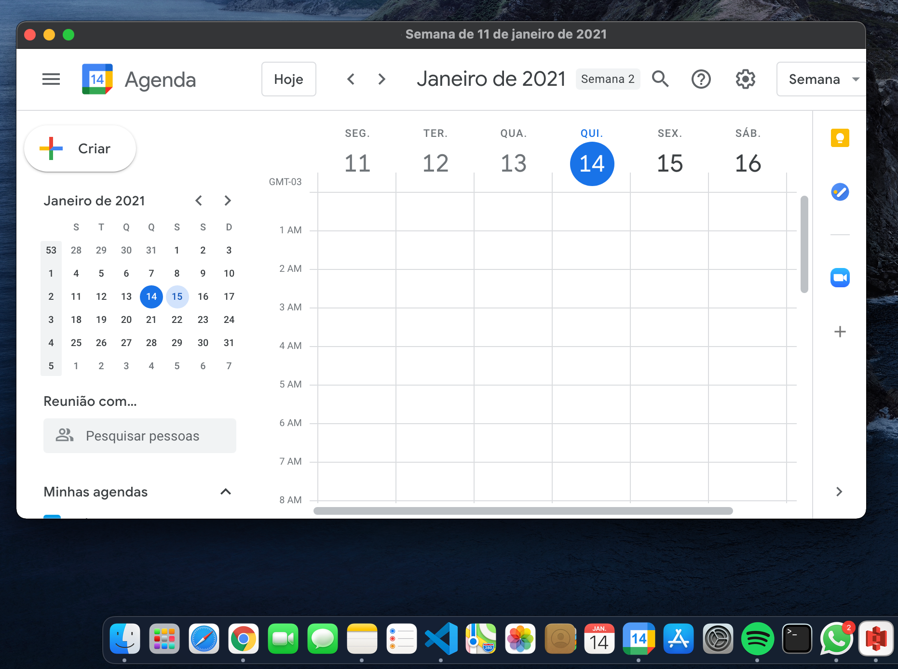

# Google Calendar Desktop

While google does not release an official desktop version of google calendar. This is an alternative



# Download Google Calendar Desktop

It is available to download for macOS. Precompiled downloads are available here [releases](https://github.com/felipekbca/GoogleCalendarDesktop/releases)


## Building

### Prerequisites

Before you get started you'll need the following

- Nodejs v12.19.0
- npm >= 6.14.11
- electron >= 11.1.1

First, clone the repo via git and install dependencies:

```bash
git clone https://github.com/felipekbca/GoogleCalendarDesktop.git
cd GoogleCalendarDesktop
npm install all
```

## Starting Development

Start the app in the `dev` environment:

```bash
npm start
```

## Packaging the app

To package apps for the local platform:

```bash
npm run build
```
